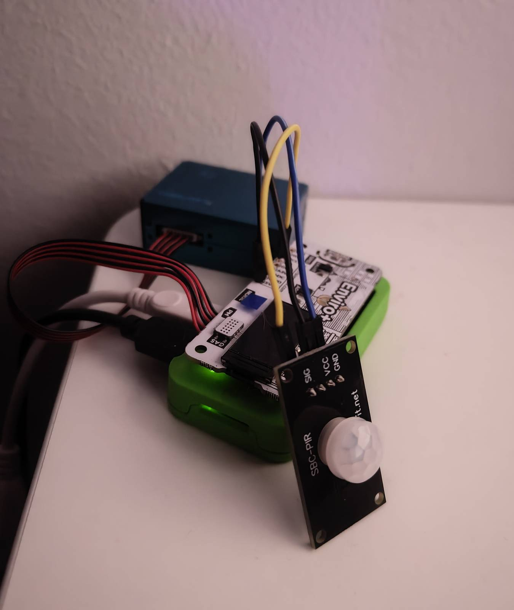
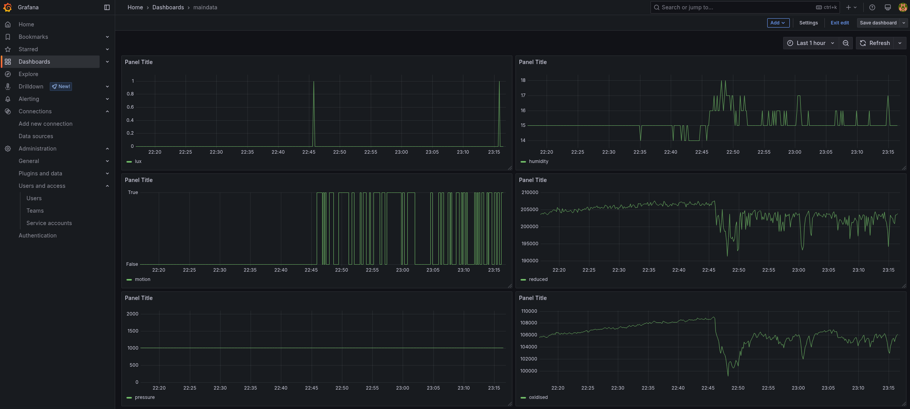

# RoomTracr

Huoneen käyttöasteen ja ympäristödatan mittaus.


## Käytetty laitteisto ja palvelut

- Raspberry Pi Zero W
- Pimoroni Enviro+ 
- PIR-liiketunnistin (SBC-PIR)
- PostgreSQL-tietokanta (alun perin CSC DBaaS, myöhemmin oma Docker-palvelin)
- Grafana (asennettu Hetznerin palvelimelle)

## Sensorit ja mitattavat arvot

Sensorit mittaavat seuraavat arvot:

- Lämpötila
- Ilmanpaine
- Ilmankosteus
- Kaasut:
    - `oxidised`: hapettavat kaasut (esim. NO₂)
    - `reduced`: pelkistävät kaasut (esim. CO, alkoholit)
  - `nh3`: esim. ammoniakki
- Ilman partikkelit (PM1, PM2.5, PM10)
- Valo (lux)
- Liiketunnistus (motion: True/False)

## Yhteyksien ja IP-osoitteiden konfigurointi

Jotta järjestelmän eri osat voivat kommunikoida CSC:n tietokannan kanssa, hyväksyttiin kaksi IP-osoitetta CSC:n tietokannan CIDR-säännöstöön:

- Raspberry Pi lähettää sensoridataa CSC:n tietokantaan Python-skriptin kautta.
- Hetznerin palvelin pyörittää Grafanaa, joka hakee ja visualisoi tietokannassa olevaa dataa.

### Raspberry Pi:n valmistelu ja Enviro+:n asennus

1. Flashaa Raspberry Pi OS microSD-kortille ja käynnistä Pi.

2. Yhdistä Pi WiFi-verkkoon.

3. Asenna Enviro+-kirjasto:
```bash
git clone https://github.com/pimoroni/enviroplus-python
cd enviroplus-python
./install.sh
```

**PIR-liiketunnistimen kytkeminen**

Liiketunnistin kytkettiin suoraan Enviro+-levyn läpivienteihin seuraavasti:

- SIG → GPIO 4 
- VCC → 5V 
- GND → GND
  


Tunnistin mittaa liikettä ja palauttaa `True`, kun liikettä havaitaan.

### PostgreSQL-tietokanta CSC:n DBaaS:ssa

**CSC DBaaS (projektin alkuvaiheessa)**

1. Luotu tietokanta CSC:n hallintapaneelissa.

2. Lisätty Raspin ja Hetznerin palvelimen IP-osoitteet sallittuihin (CIDR-luettelo).

3. Luotu taulu tietokantaan:
```sql
CREATE TABLE data (
    id SERIAL PRIMARY KEY,
    timestamp TIMESTAMP DEFAULT CURRENT_TIMESTAMP,
    temperature INTEGER,
    pressure INTEGER,
    humidity INTEGER,
    oxidised INTEGER,
    reduced INTEGER,
    nh3 INTEGER,
    pm1 REAL,
    pm2_5 REAL,
    pm10 REAL,
    motion BOOLEAN,
    lux INTEGER
);
```
### Siirto omalle palvelimelle

**Dockerin pystytys Hetzner-palvelimella**

``` bash
docker run --name=db \
  -e POSTGRES_PASSWORD=<password> \
  -p <port>:<port> \
  -d -v postgres_data:/var/lib/postgresql/data postgres
```

**Lokaali Docker**

Paikallinen Docker-kontti ajettiin samaa PostgreSQL-versiota käyttäen kuin tuotantokannassa, jotta varmistettiin yhteensopivuus dumpin ja palautuksen välillä, koska eri PostgreSQL-versioiden välillä voi tulla ongelmia dump/restore-prosessissa.

```bash
docker run --rm -it -v ~/asdf:/asdf docker.io/postgres:17 bash
```

**Varmuuskopiointi (dump) paikallisessa Docker-kontissa**

Tietokanta dumpattiin vanhasta kannasta tiedostoon:
```bash
pg_dump -U <user> -d <db_name> -f <file.sql> -h <ip>
```

**Palautus (restore) paikallisessa Docker-kontissa:**

Dump -tiedosto ajettiin uuteen tietokantaan palautuksena:

```bash
psql -h <ip> -U <user> -d <db_name> -f <file.sql>
```

### Datan keruu (Raspilla)

Python-skripti (`main.py`) lukee sensoreita ja tallentaa arvot PostgreSQL-tietokantaan 10 sekunnin välein. 

### Grafana (Hetznerin palvelimella)

1. Vuokrattu Hetznerin palvelin (debian).

2. Asennettu Docker ja Grafana
   
```bash
docker run -d -p 3000:3000 \
  --name=grafana \
  --volume grafana-storage:/var/lib/grafana \
  --restart always \
  grafana/grafana-oss
```

3. Selaimella osoitteeseen `http://<hetzner-ip>:3000`

4. Lisätty PostgreSQL-tietokanta Grafanan tietolähteeksi(Data sources)

5. Luotu Dashboard ja sinne `data`-taulusta kentät (lämpötila, liike, valo...)



**Käyttöasteen mittaus Grafanassa**

Käyttöasteen mittaus suoraan Grafanassa lisäämällä paneeliin sql lauseke:

```sql
SELECT
  date_range,
  (COUNT(*)::decimal / 24) * 100 AS room_occupied
FROM (
  SELECT
    DATE_TRUNC('day', timestamp) AS date_range,
    DATE_TRUNC('hour', timestamp) AS hour,
    AVG(motion::int) AS avg_motion,
    AVG(lux) AS avg_light_when_occupied,
    AVG(oxidised) AS avg_oxidise_when_occupied,
    AVG(pressure) AS avg_pressure_when_occupied,
    AVG(reduced) AS avg_reduced_when_occupied,
    AVG(humidity) AS avg_humidity_when_occupied
  FROM data
  WHERE timestamp BETWEEN $__timeFrom() AND $__timeTo()
  GROUP BY date_range, DATE_TRUNC('hour', timestamp)
) AS hourly_data
WHERE avg_motion > 0
GROUP BY date_range
ORDER BY date_range;
```
→ Lasketaan tunneittain käyttöä, ja niistä koostetaan prosentuaalinen käyttöaste / päivä.  

### Kaasuarvojen tulkinta

Enviro+:ssa on MICS6814-kaasusensori, joka mittaa kolmea kaasuluokkaa:

- Oxidising → havaitsee hapettavia kaasuja (esim. NO₂)

- Reducing → havaitsee pelkistäviä kaasuja (esim. CO, alkoholit)

- NH₃ → havaitsee ammoniakkia


Sensori ei anna suoraan kaasujen pitoisuuksia (ppm), vaan mittaa resistanssia sensorin sisällä olevassa materiaalissa.

Periaate:

- Kun ilmassa on enemmän kaasumolekyylejä → kaasua tarttuu sensorin pintaan

- → Sensorin johtavuus kasvaa, mikä tarkoittaa että

- → Resistanssi (vastus) laskee


Lopputulos: enemmän kaasua ilmassa → matalampi resistanssi → pienempi arvo

Toisin sanoen:

- Korkeat arvot → ilma puhtaampaa

- Matala arvo → enemmän kaasuja ilmassa (esim. ihmisen läsnäolo, ruoanlaitto, hengitys)

